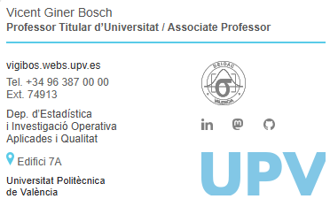

# upv-email-firma. Firma de correo UPV para el nuevo Outlook

<!-- Si el usuario o el nombre del repositorio no coinciden, ajústalos en las
     URLs de las pastillas. El color 59CBE8 es el cian corporativo de la
     UPV. -->

[](https://github.com/vginer/upv-email-firma/commits)
[](CHANGELOG.md)


[](https://creativecommons.org/licenses/by/4.0/deed.es)

Firma de correo electrónico conforme a la identidad visual de la Universitat
Politècnica de València, reconstruida para que sobreviva al editor de firmas
del **nuevo Outlook** y a los saneadores de HTML de Gmail, Yahoo y los clientes
de iOS.

Es **mi firma**, con mis datos, no una plantilla genérica. La comparto porque
las plantillas que distribuye la UPV están pensadas para el Outlook clásico y
se descomponen al pegarlas en el editor del nuevo Outlook: aparecen recuadros
alrededor de las celdas, se pierde la línea de color, los espacios verticales
se colapsan y las imágenes pierden sus enlaces. Los puntos que hay que tocar
para reutilizarla van marcados en el HTML con `[CAMBIAR]`.



---

## Antecedentes y documentación oficial

- **Documento normativo con los modelos de firma** (mide 1:1 en píxeles, es la
  fuente de todas las medidas de este archivo):
  <https://www.upv.es/comu/nueva-imagen/recursos/ANEXO_modelos_firmas_correo-UPV.pdf>
- **Plantillas y ayuda del CAU** (pensadas para el Outlook clásico):
  <https://wiki.upv.es/confluence/spaces/FAQCAU/pages/598442013/Correo+Identidad+Visual>
- **Gestión de marca e identidad visual corporativa de la UPV**:
  <https://www.upv.es/entidades/acom/gestion-marca-identidad-visual-corporativa-2/>

Esta versión corresponde al modelo **«firma base sin foto» (360 px)** combinado
con la **plantilla de personal de escuelas, facultades, unidades docentes y de
investigación** (la que lleva logotipo de la unidad).

---

## Contenido

```
A_UPV_no_foto_azul_VGB_v1.htm          la firma
A_UPV_no_foto_azul_VGB_archivos/       las seis imágenes, ya al tamaño final
README.md                              este archivo
CHANGELOG.md                           registro de cambios
```

Las imágenes van **al tamaño exacto al que se muestran**, porque el editor de
firmas del nuevo Outlook no permite redimensionarlas: entran con su tamaño
natural. No las reescales.

| archivo | tamaño | color | qué es |
|---|---|---|---|
| `deioac_gris.png` | 50 × 50 px | gris `#808080` | logotipo de la unidad (máx. 140 × 50 px) |
| `linkedin.png` | 13 × 13 px | gris `#808080` | icono de red social |
| `mastodon.png` | 12 × 13 px | gris `#808080` | icono de red social |
| `github.png` | 13 × 13 px | gris `#808080` | icono de red social |
| `pin_map_AZ.png` | 9 × 15 px | cian UPV `#59CBE8` | chincheta del edificio |
| `upv_grafo_AZ.png` | 140 × 49 px | cian UPV | grafo de la UPV |

El logotipo de la unidad (mi departamento, en este caso) va en **gris y no en
negro** a propósito: un logotipo negro sobre transparente prácticamente
desaparece cuando el destinatario lee con el tema oscuro, porque los clientes
invierten el texto pero nunca tocan los píxeles de una imagen. El gris
`#808080` se lee sobre fondo claro y sobre fondo oscuro, y además es el mismo
gris de los iconos.

Para la versión amarilla bastan `pin_map_AM.png` y `upv_grafo_AM.png`, y
cambiar en el HTML las dos apariciones de `#59CBE8` por `#FFD100`.

---

## Cómo adaptarla a tus datos

Abre el `.htm` en un editor de texto y busca las marcas `[CAMBIAR]`. Son nueve:

1. **Nombre** (10,5 pt, `#555555`).
2. **Cargo** (9 pt negrita, `#5A5A5A`).
3. **Web o correo** (9 pt, `#333333`). La norma pone aquí el correo; yo
   prefiero la web, porque quien recibe un correo mío ya sabe mi dirección.
4. **Teléfono** (9 pt, `#666666`).
5. **Extensión** (9 pt, `#666666`).
6. **Unidad** (9 pt, `#4D4D4D`).
7. **Edificio** y enlace al plano (9 pt, `#666666`). Puedes eliminar el enlace
   si quieres. A mí me parecía útil proporcionar esa información como link.
8. **Logotipo de la unidad** (máx. 140 × 50 px).
9. **Iconos y enlaces** de redes sociales (13 px de alto, máximo cinco).

La línea **Universitat Politècnica de València** (8,5 pt, `#29282B`) no lleva
marca porque no se cambia: es la única que la norma fija igual para todo el
mundo.

Los colores y los cuerpos de letra están medidos sobre el PDF normativo. El
realce del correo, la web y el nombre de la universidad **no es negrita**: en el
documento oficial es Helvetica Regular frente a Helvetica Light del resto. Como
Windows sustituye Helvetica por Arial y Arial no tiene versión Light, aquí ese
contraste se reproduce con el color.

### Si tu texto ocupa más o menos líneas

La firma alinea la primera línea de texto con el borde superior del logotipo y
la última con la base del grafo. Eso no lo hace el correo solo: está calculado.
La columna derecha es rígida y mide **152 px**:

```
50 (logotipo) + 15 (hueco) + 13 (iconos) + 25 (hueco) + 49 (grafo) = 152 px
```

La columna izquierda suma las alturas de sus filas más tres huecos iguales `G`:

```
14 (web) + 5 (hueco corto) + 14 (Tel) + 14 (Ext) + 42 (unidad, 3 × 14)
+ 18 (edificio) + 26 (universidad, 2 × 13) = 133 px + 3G

alto visual = 133 + 3G − 5,14        →  igualando a 152:  G = 8 px
```

El 5,14 son los 2,57 px de espacio muerto que toda línea de texto tiene por
encima de la altura de mayúscula y por debajo de la línea base. Si añades o
quitas líneas, recalcula:

```
G = (152 − suma alturas izquierda + 5,14) / número de huecos    (G ≥ 5 px)
```

y escribe el resultado en las tres filas separadoras (`height` en puntos, que
son píxeles × 0,75).

**Si la columna alta pasa a ser la izquierda**, no repartas el sobrante entre
los dos huecos de la derecha: no es lo que hace la norma. Midiendo los modelos
del PDF que llevan logotipo se ve que el hueco entre los iconos y el grafo se
mantiene siempre entre 25 y 30 px, y que **todo el sobrante va al hueco entre el
logotipo y los iconos**:

| modelo del PDF | alto del logotipo | logotipo → iconos | iconos → grafo |
|---|---|---|---|
| plantilla escuelas | 50,0 px | 15,4 px | 26,7 px |
| ejemplo Telecom | 47,4 px | 15,4 px | 29,6 px |
| ejemplo Ing. Rural | 37,3 px | 25,5 px | 29,6 px |
| ejemplo VRAIN | 25,0 px | 37,8 px | 29,6 px |
| ejemplo Caminos | 19,6 px | 43,4 px | 29,6 px |
| centro ICCP | 19,5 px | 40,2 px | 26,7 px |

Dicho de otro modo: **logotipo pegado arriba, grafo pegado abajo, iconos a unos
27 px del grafo, y el aire sobrante entre el logotipo y los iconos**. Cuanto más
bajo es el logotipo, mayor es ese hueco. Fija entonces `G = 5 px` en la
izquierda y dale al hueco logotipo → iconos el valor
`alto visual izquierdo − alto del logotipo − 13 − 27 − 49`.

En la columna izquierda, en cambio, la norma no sigue una regla estricta para
repartir su propio sobrante: en la plantilla base los huecos quedan
aproximadamente iguales, mientras que en el ejemplo del VRAIN —que tiene una
línea menos— casi todo el aire se acumula en un solo hueco, el que precede a
«Edificio» (46 px, frente a los 23,5 px del ejemplo de Caminos). Repartirlo a
partes iguales, como hace esta firma, es la lectura más regular de la norma.

Todo esto está también, en detalle, en los comentarios del propio HTML.

### Si prefieres no poner el logotipo de tu unidad

La norma solo lleva logotipo en las plantillas de escuelas, facultades, unidades
docentes y de investigación. Si no es tu caso, o prefieres no ponerlo, hay que
quitar del HTML **dos filas de la tabla derecha**: la del logotipo y la fila
separadora de 15 px que va justo debajo. La tabla sigue siendo válida, porque
los anchos de columna los definen las demás filas.

Sin el logotipo, la columna derecha se queda en 13 (iconos) + hueco + 49
(grafo), y **la columna alta pasa a ser la izquierda**: con el contenido de esta
firma y los huecos al mínimo (`G = 5 px`) mide 133 + 15 − 5,14 = **142,9 px** de
alto visual.

Lo que hace la norma en ese caso es lo mismo que con logotipo, pero con un
elemento menos: **los iconos se quedan arriba y el grafo abajo, y el hueco entre
ellos es el que crece**. Medido sobre los modelos del PDF que no llevan
logotipo:

| modelo del PDF sin logotipo | iconos → grafo |
|---|---|
| firma base (400 px), máxima (440 px) y sin foto (360 px) | 24,8 px |
| campus de Gandia y de Alcoy | 55,6 px |
| unidades internas | 66,5 px |

Así que el ajuste es directo: deja los iconos donde están —arriba, alineados con
la primera línea de texto, conservando el `padding-top:1.875pt` de la celda
derecha— y dale al único hueco que queda el valor

```
hueco iconos → grafo = alto visual izquierdo − 13 − 49
```

Un aviso: si ese hueco te sale muy por encima de los 66 px que marca el modelo
más estirado de la norma, es señal de que el bloque izquierdo tiene demasiado
contenido para una firma sin logotipo. Con el contenido íntegro de esta firma
saldrían 89,9 px, que es excesivo. La propia norma indica el camino: en los
modelos sin logotipo, el bloque izquierdo tampoco lleva el nombre de la unidad,
porque esa línea viaja con el logotipo. Quitando esa fila, la izquierda queda en
14 (correo) + 5 (hueco corto) + 14 (Tel) + 14 (Ext) + 18 (edificio) +
26 (universidad) = 91 px más **dos** huecos; con `G = 5 px` son **95,9 px**, y
el hueco entre iconos y grafo sale de **34 px** (25,5 pt), justo en mitad del
rango que usa la norma.

Y una consecuencia práctica: al montarla en Outlook serán **cinco imágenes y
cuatro enlaces**, no seis y cinco.

---

## Cómo montarla en el nuevo Outlook

**El orden importa: primero la imagen, después el enlace.** Si intentas
insertar la imagen «dentro» del enlace que ya viene en el HTML, el editor se
come el enlace. Y si pones el enlace antes de tener la imagen, no hay nada que
enlazar. Por eso se hace en dos pasadas.

1. Abre `A_UPV_no_foto_azul_VGB_v1.htm` en el navegador (doble clic). Debes ver
   la firma completa y con las imágenes.
2. Selecciona todo (`Ctrl+A`) y copia (`Ctrl+C`).
3. En Outlook: **Configuración** (rueda dentada) → **Cuentas** → **Firmas** →
   **Nueva firma**. Ponle un nombre.
4. Pega en el cuadro de edición (`Ctrl+V`). El texto y la línea de color se ven
   bien; en el lugar de cada imagen aparece un marcador de imagen rota con su
   texto alternativo: *DEIOAC*, *LinkedIn*, *Mastodon*, *GitHub*, *UPV* y
   *mapa UPV*. Son seis.
5. **Primera pasada, las imágenes.** Para cada marcador de imagen rota: deja el
   cursor en su sitio (no es necesario borrar el marcador) e inserta la imagen
   con el botón de imagen del editor. Elige el archivo de la carpeta
   `A_UPV_no_foto_azul_VGB_archivos`. **No la redimensiones**: ya viene al
   tamaño correcto.
6. **Segunda pasada, los enlaces.** Con las seis imágenes ya colocadas,
   selecciona cada una con un clic y pulsa el botón de enlace (o `Ctrl+K`), pega
   la dirección y acepta:

   | imagen | enlace |
   |---|---|
   | logotipo de la unidad | `http://www.upv.es/entidades/DEIO/` |
   | LinkedIn | `https://www.linkedin.com/in/vginer` |
   | Mastodon | `https://mathstodon.xyz/@vginer_upv` |
   | GitHub | `https://github.com/vginer` |
   | grafo UPV | `https://www.upv.es/` |
   | chincheta | *sin enlace* — el enlace al plano va en el texto «Edifici 7A» |

7. Guarda y asigna la firma a los mensajes nuevos y a las respuestas.
8. **Envíate un mensaje de prueba** y comprueba tres cosas:
   - la base de «de València» queda a la altura de la base del grafo UPV
     (si no, alguna imagen ha entrado con un tamaño distinto del previsto);
   - los bloques de la izquierda conservan su separación (si se juntan, el
     cliente se ha comido los separadores);
   - al pasar el ratón por cada imagen aparece su enlace.

Los textos emergentes (`title`) de los enlaces (asociados a las etiquetas `A`
del código HTML) se pierden por el camino. No hay forma de conservarlos desde
el editor; tampoco es una gran pérdida.

---

## Cómo crear iconos de otras redes sociales

La norma admite **hasta cinco iconos**, de **13 px de alto fijo**.

1. Descarga el SVG en <https://simpleicons.org> (marcas de más de 3.000
   servicios, en dominio público CC0) o del kit oficial de la red en cuestión.
2. Ábrelo en Inkscape, Illustrator o Affinity Designer y **cambia el relleno a
   `#808080`**.
3. Ajusta el lienzo al contenido y escala a **13 px de alto**, manteniendo la
   proporción. El ancho es libre: los iconos no tienen por qué ser cuadrados
   (el de Mastodon de esta firma mide 12 × 13).
4. Activa el ajuste a la rejilla de píxeles antes de exportar. A 13 px, un
   trazo mal alineado se convierte en dos medios píxeles grises y el icono se
   ve sucio.
5. Exporta a **PNG con transparencia, a 1×** (13 px de alto exactos). No
   exportes grande y reduzcas después: ahí es donde se pierde la definición.

Para añadirlo al HTML, duplica uno de los bloques `<td>` de icono y cambia
`src`, `alt`, `width`, `height`, el `href` y las medidas del bloque VML (en
puntos: píxeles × 0,75). La fila de iconos son cuatro celdas de 35 px; con tres
iconos, la cuarta va vacía. Si quieres cinco iconos, pasa a cinco celdas de
28 px para que el bloque siga midiendo 140.

---

## Limitaciones conocidas

Salieron todas de probar la firma en Yahoo, Gmail (escritorio, iOS) y Outlook
(Windows, iOS). En escritorio el resultado es exacto; en móvil hay desviaciones
de pocos píxeles.

- **La línea de color se oscurece con el tema oscuro.** Medido: `#59CBE8` llega
  como `#005A72` en Outlook iOS y el amarillo `#FFD100` como `#443700` en Gmail
  iOS. La línea es un fondo de celda, y los motores de modo oscuro remapean los
  colores declarados; a las imágenes no las tocan. La única solución completa
  sería hacer la línea con una imagen de 360 × 2 px, a costa de una inserción
  manual más.
- **Gmail para iOS agranda las fuentes pequeñas** e ignora `text-size-adjust`.
  Los huecos de la derecha crecen de 15/25 px a 19/33 y la alineación inferior
  se desvía unos 6 px.
- **Outlook para iOS detecta el número de teléfono** y lo pinta como enlace azul
  subrayado, arrastrando también la extensión. No se puede evitar: el
  `<meta format-detection>` no sobrevive al editor y un enlace `tel:` propio
  tampoco, porque el saneador solo admite `http`, `https` y `mailto`.
- **Un logotipo negro desaparece sobre fondo oscuro.** De ahí el gris.

---

## Por qué está hecho así

Por si a alguien le sirve para depurar su propia firma:

- **Tablas, no `div`.** El Outlook clásico renderiza con el motor de Word: no
  admite `inline-block`, ni flexbox, ni `float` fiable. Dos columnas contiguas
  que compartan altura solo se consiguen con una tabla.
- **Todo el CSS en línea.** Al pegar en el editor de firmas solo sobrevive el
  fragmento: se pierden `<head>`, `<style>`, el `<body>` y sus atributos. Nada
  de consultas de medios, `color-scheme` ni `format-detection`.
- **La línea de color es el fondo de una celda, no un borde.** Un `bgcolor`
  sobrevive a cualquier saneado; un borde declarado en los estilos, no siempre.
  Y ojo con dejar `border=1` en la tabla: el editor conserva el atributo y
  descarta el `border:none` de los estilos, y entonces pinta el recuadro de
  todas las celdas.
- **Los separadores llevan dentro un `&nbsp;` con `font-size` y `line-height`
  iguales a la altura del hueco.** Una celda vacía con solo `height` colapsa en
  Yahoo (y quizás también en otros clientes). La altura tiene que venir del
  contenido.
- **Las alturas van como `height` en `<tr>` y `<td>`**, que Word trata como
  mínimos: si algo no cupiera, la fila crece en lugar de recortar.
- **Sin párrafos vacíos al final**, que en el editor se convierten en líneas en
  blanco bajo la firma.

---

## Marcas y licencia

El grafo de la UPV y el logotipo del DEIOAC son marcas de sus titulares y se
utilizan conforme a la identidad visual corporativa de la Universitat
Politècnica de València. Si adaptas esta firma, sustituye el logotipo de la
unidad por el de la tuya y respeta el documento normativo enlazado arriba.

El código HTML de este repositorio se comparte bajo licencia
[CC BY 4.0](https://creativecommons.org/licenses/by/4.0/deed.es), sin garantía
de ningún tipo. Los iconos de redes sociales proceden de sus respectivas
marcas.

## Cómo se hizo

La reconstrucción del HTML, las mediciones sobre el documento normativo y la
depuración cliente por cliente se hicieron con la ayuda de **Claude (Opus 5)**,
de Anthropic, a lo largo de una serie de sesiones de trabajo en agosto de 2026.
Las medidas que aparecen en este README —los tamaños del PDF oficial, los
colores que devuelve cada cliente en modo oscuro, las desviaciones en iOS— no
son estimaciones: salieron de medir píxel a píxel los renders y las capturas de
las pruebas. Las decisiones de contenido y el criterio final son míos.

[Vicent Giner Bosch](https://vigibos.webs.upv.es) — Universitat Politècnica de
València
